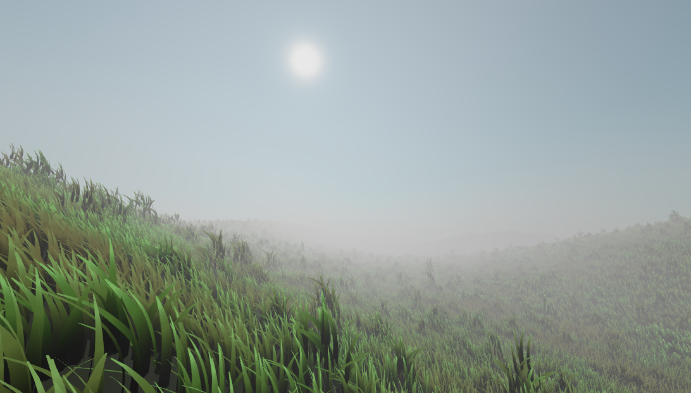

# Grassland

This is a 3D demo for LÖVR framework. It showcases several techniques:
* procedural generation of sun and atmosphere skybox (Rayleigh and Mie scattering)
* rendering of infinite procedural terrain divided in tiles
* drawing a large number of grass blades (geometry instancing)
* volumetric screenspace-raymarched fog (Wronski method)

Tested with LÖVR version `0.18.0`



If you can improve it please let me know!

### Volumetric fog

The fog module prepares the fog volumetric lookup in two stages:

* medium density and in-scattering of each voxel is computed into a 3D texture aligned with camera frustum

* the raymarching computes final lookup values of transmittance and in-scattering

This produces no visual results. Instead, all other scene elements (grass, terrain mesh, skybox) need to use `vfog.fragment` GLSL snippet to add the fog influence on its fragments, along any other shader processing.

Here's how to integrate volumetric fog:

```Lua
local vfog = require('vfog')
local shader = lovr.graphics.newShader('unlit', vfog.fragment .. [[
vec4 lovrmain() {
  vec4 color = DefaultColor;
  addVFog(color);
  return color;
}]]
```

## User interface

Still WiP. The UI uses right mouse button for interaction (VR should work with direct controller
pushing the widgets). When running in simulator use *Ctrl* + arrows to fine-position the camera.

The editable numerical values have a `[ - ]` button on left side which enables negative values. On
right side the `[ >> ]` increases (doubles) the slider range while `[ << ]` button decreases
(halves) the range to get more precision while dragging the slider.

### Recycling modules

While individual modules were made to be reusable in different contexts, some coupling was necessary
to make a cohesive demo. If you'd like to use one of these modules without the rest of demo source
files, the dependencies will need to be severed:

**vfog** can be mostly taken as-is to infuse the volumetric fog into any rendered scene. Each drawn
object needs to use a special shader to show the fog influence. In this demo the fog thicker at low
altitudes and this medium density distribution follows the contours of terrain; the same
mathematically defined contours that the grass uses. The `density_shader` code can easily be
corrected to not use the terrain and to consider the world flat.

**atmo** can be used as-is for real-time atmosphere rendering (too costly), or taken togeter with
*skybox* it can be triggered to generate the atmosphere snapshot to draw as a cubemap.

**skybox** captures rendered geometry onto a cubemap, for baking the far-away geometry or scattering
onto the skybox / cubemap. Here, rendering uses volumetric fog lookup to influence the color.
Without the volumetric fog the skybox rendering is much simpler and the custom shader can be bypassed
(see [lovr-atmo](https://github.com/jmiskovic/lovr-atmo/)).

**grass** implements both the terrain mesh tiles and grass blades. Both use the volumetric fog
result lookup to show the fog, but that bit can be removed or replaced with a different shading model.

**fromTable** is a utility that constructs an in-3D world UI panel that exposes a Lua table to
interact with in the runtime. Here we visualize the uniforms sent to GPU that affect rendering of
grass and fog. The `fromTable` is very convenient tool to quickly tweak some values. There are also
more useful chui widgets in there: **foldable** creates a collapsing nested panel, a RGB
/ HSL **colorPicker** widget.
